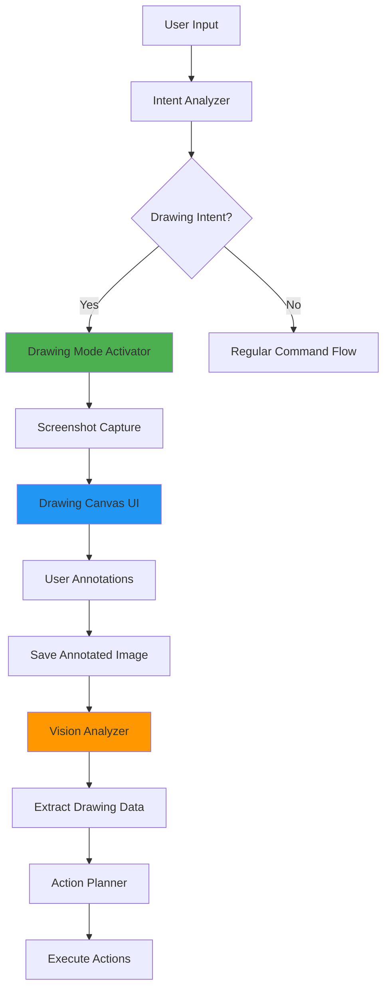
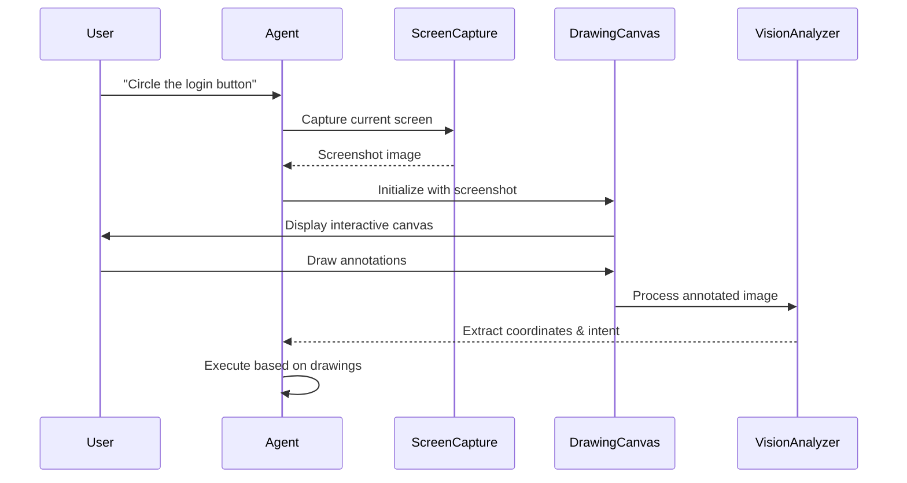
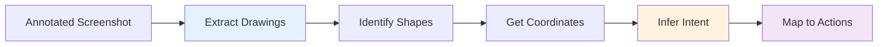

# Complete Drawing Workflow for OS Agent

## Overview
This document outlines the complete workflow for implementing drawing/annotation capabilities in the OS Agent system, enabling users to visually interact with screenshots, create annotations, and provide visual feedback for the AI agent.

---

## Architecture Components



---

## Workflow Phases

### Phase 1: Detection & Activation

**Trigger Points:**
- User command contains drawing keywords: "draw", "annotate", "mark", "circle", "highlight"
- User requests visual feedback: "show me where to click", "mark the button"
- Agent needs user clarification on screen elements

**Implementation:**
```python
# In intent_analyzer.py
def is_drawing_intent(self, command):
    drawing_keywords = [
        'draw', 'annotate', 'mark', 'circle', 
        'highlight', 'point to', 'show where'
    ]
    return any(keyword in command.lower() for keyword in drawing_keywords)
```

---

### Phase 2: Canvas Initialization

**Steps:**
1. Capture current screen state
2. Create drawing overlay window
3. Load screenshot into canvas
4. Initialize drawing tools

**Technical Flow:**


---

### Phase 3: Drawing Tools

**Available Tools:**

| Tool | Purpose | Output Data |
|------|---------|-------------|
| **Freehand** | Custom paths | Path coordinates array |
| **Circle/Ellipse** | Highlight areas | Center point + radius |
| **Rectangle** | Select regions | Top-left + bottom-right coords |
| **Arrow** | Point to elements | Start + end coordinates, direction |
| **Text** | Add labels | Position + text content |
| **Eraser** | Remove annotations | Modified path data |

**Data Structure:**
```python
annotation = {
    'type': 'circle',  # tool type
    'coordinates': {
        'x': 450,
        'y': 300,
        'radius': 50
    },
    'color': '#FF0000',
    'timestamp': '2025-11-26T21:44:46',
    'intent': 'click_target'  # AI-inferred
}
```

---

### Phase 4: User Interaction

**Canvas Controls:**

```
┌─────────────────────────────────────────┐
│  🖊️  ○  □  ↗️  T  ⌫  ✓  ✗            │  ← Toolbar
├─────────────────────────────────────────┤
│                                         │
│         [Screenshot Canvas]             │
│                                         │
│     User draws annotations here         │
│                                         │
│                                         │
├─────────────────────────────────────────┤
│ Instructions: Draw to indicate targets │  ← Footer
│ [Confirm] [Clear] [Cancel]              │
└─────────────────────────────────────────┘
```

**Keyboard Shortcuts:**
- `Enter` - Confirm and process
- `Esc` - Cancel drawing mode
- `Ctrl+Z` - Undo last annotation
- `C` - Circle tool
- `R` - Rectangle tool
- `A` - Arrow tool

---

### Phase 5: Vision Analysis

**Processing Pipeline:**



**Analysis Tasks:**

1. **Shape Detection**
   - Identify drawn shapes (circles, arrows, rectangles)
   - Extract bounding boxes and center points
   - Calculate dimensions and orientations

2. **Intent Inference**
   - Circle → Click target
   - Arrow → Direction/navigation
   - Rectangle → Region selection
   - Text → Label/instruction

3. **Coordinate Extraction**
   - Convert canvas coordinates to screen coordinates
   - Account for scaling and positioning
   - Generate precise click/action points

**Implementation Example:**
```python
# In vision_analyzer.py
def analyze_drawing(self, annotated_image, original_screenshot):
    """Analyze user drawings to extract actionable data."""
    
    # 1. Detect annotations
    annotations = self.detect_shapes(annotated_image)
    
    # 2. For each annotation
    actions = []
    for annotation in annotations:
        if annotation['type'] == 'circle':
            # Extract center point as click target
            target = {
                'action': 'click',
                'x': annotation['center_x'],
                'y': annotation['center_y'],
                'confidence': 0.95
            }
            actions.append(target)
            
        elif annotation['type'] == 'arrow':
            # Determine navigation direction
            direction = self.calculate_direction(
                annotation['start'], 
                annotation['end']
            )
            actions.append({
                'action': 'scroll',
                'direction': direction
            })
    
    return actions
```

---

### Phase 6: Action Execution

**Workflow:**

1. **Validation**
   - Verify coordinates are within screen bounds
   - Check if elements are clickable
   - Confirm action safety

2. **Execution**
   - Perform clicks at marked locations
   - Execute indicated actions
   - Monitor for success/failure

3. **Verification**
   - Take post-action screenshot
   - Compare with expected state
   - Report results to user

**Execution Flow:**
```python
# In agent.py
def execute_drawing_based_actions(self, actions, screenshot_path):
    """Execute actions derived from user drawings."""
    
    results = []
    for action in actions:
        try:
            if action['action'] == 'click':
                # Move to marked position
                pyautogui.moveTo(action['x'], action['y'], duration=0.5)
                
                # Visual confirmation
                self.logger.info(f"Clicking at ({action['x']}, {action['y']})")
                
                # Execute click
                pyautogui.click()
                
                # Verify action
                time.sleep(1)
                verification = self.verify_action(
                    action, 
                    screenshot_path
                )
                
                results.append({
                    'action': action,
                    'success': verification['success'],
                    'details': verification['details']
                })
                
        except Exception as e:
            results.append({
                'action': action,
                'success': False,
                'error': str(e)
            })
    
    return results
```

---

## Integration with Existing Components

### 1. Intent Analyzer Enhancement
```python
# intent_analyzer.py - Add drawing intent detection
def analyze(self, command):
    intent = super().analyze(command)
    
    # Check for drawing intent
    if self.is_drawing_intent(command):
        intent['requires_drawing'] = True
        intent['drawing_purpose'] = self.infer_drawing_purpose(command)
    
    return intent
```

### 2. GUI Integration
```python
# gui_advanced.py - Add Drawing Mode button
def initUI(self):
    # ... existing UI code ...
    
    # Add Drawing Mode toggle
    self.drawing_btn = QPushButton("🎨 Drawing Mode")
    self.drawing_btn.clicked.connect(self.launch_drawing_canvas)
    control_layout.addWidget(self.drawing_btn)
    
def launch_drawing_canvas(self):
    """Open drawing canvas for user annotations."""
    # Capture current screen
    screenshot = self.capture_screen()
    
    # Launch canvas window
    self.canvas = DrawingCanvas(screenshot, parent=self)
    self.canvas.show()
    
    # Connect signals
    self.canvas.annotations_ready.connect(
        self.process_annotations
    )
```

### 3. Vision Analyzer Enhancement
```python
# vision_analyzer.py - Add annotation processing
def process_annotated_screenshot(self, image_path):
    """Analyze screenshot with user annotations."""
    
    # Load image
    image = Image.open(image_path)
    
    # Detect annotations (colored overlays)
    annotations = self.detect_annotations(image)
    
    # Convert to actions
    actions = self.annotations_to_actions(annotations)
    
    return {
        'annotations': annotations,
        'actions': actions,
        'confidence': self.calculate_confidence(annotations)
    }
```

---

## New Component: Drawing Canvas

### Implementation Structure

```python
# drawing_canvas.py (NEW FILE)
from PyQt5.QtWidgets import QMainWindow, QWidget
from PyQt5.QtCore import Qt, pyqtSignal, QPoint
from PyQt5.QtGui import QPainter, QPen, QPixmap, QColor
import json

class DrawingCanvas(QMainWindow):
    """Interactive canvas for user annotations."""
    
    annotations_ready = pyqtSignal(list)  # Emit when done
    
    def __init__(self, screenshot_path, parent=None):
        super().__init__(parent)
        self.screenshot = QPixmap(screenshot_path)
        self.annotations = []
        self.current_tool = 'freehand'
        self.drawing = False
        self.last_point = QPoint()
        
        self.initUI()
    
    def initUI(self):
        """Setup drawing canvas UI."""
        self.setWindowTitle("Drawing Canvas - Annotate Screenshot")
        self.setGeometry(100, 100, 1200, 800)
        
        # Setup canvas
        self.canvas = QWidget(self)
        self.setCentralWidget(self.canvas)
        
        # Create toolbar
        self.create_toolbar()
        
        # Set cursor
        self.setCursor(Qt.CrossCursor)
    
    def create_toolbar(self):
        """Create drawing tools toolbar."""
        toolbar = self.addToolBar("Tools")
        
        # Tool buttons
        tools = [
            ("✏️ Freehand", "freehand"),
            ("○ Circle", "circle"),
            ("□ Rectangle", "rectangle"),
            ("↗️ Arrow", "arrow"),
            ("T Text", "text"),
            ("⌫ Eraser", "eraser")
        ]
        
        for label, tool in tools:
            btn = toolbar.addAction(label)
            btn.triggered.connect(
                lambda checked, t=tool: self.set_tool(t)
            )
        
        toolbar.addSeparator()
        
        # Action buttons
        confirm = toolbar.addAction("✓ Confirm")
        confirm.triggered.connect(self.confirm_annotations)
        
        clear = toolbar.addAction("Clear")
        clear.triggered.connect(self.clear_annotations)
        
        cancel = toolbar.addAction("✗ Cancel")
        cancel.triggered.connect(self.close)
    
    def set_tool(self, tool):
        """Change active drawing tool."""
        self.current_tool = tool
    
    def mousePressEvent(self, event):
        """Handle mouse press for drawing."""
        if event.button() == Qt.LeftButton:
            self.drawing = True
            self.last_point = event.pos()
            
            # Start new annotation
            self.current_annotation = {
                'type': self.current_tool,
                'start': (event.x(), event.y()),
                'path': [(event.x(), event.y())],
                'color': '#FF0000'
            }
    
    def mouseMoveEvent(self, event):
        """Handle mouse move for drawing."""
        if self.drawing and event.buttons() & Qt.LeftButton:
            # Add point to path
            self.current_annotation['path'].append(
                (event.x(), event.y())
            )
            self.update()  # Redraw
    
    def mouseReleaseEvent(self, event):
        """Handle mouse release to finish drawing."""
        if event.button() == Qt.LeftButton and self.drawing:
            self.drawing = False
            
            # Finalize annotation
            self.current_annotation['end'] = (event.x(), event.y())
            self.annotations.append(self.current_annotation)
            
            # Process shape
            self.process_annotation(self.current_annotation)
    
    def paintEvent(self, event):
        """Paint screenshot and annotations."""
        painter = QPainter(self)
        
        # Draw screenshot
        painter.drawPixmap(0, 0, self.screenshot)
        
        # Draw annotations
        pen = QPen(QColor('#FF0000'), 3, Qt.SolidLine)
        painter.setPen(pen)
        
        for annotation in self.annotations:
            self.draw_annotation(painter, annotation)
        
        # Draw current annotation
        if self.drawing and hasattr(self, 'current_annotation'):
            self.draw_annotation(painter, self.current_annotation)
    
    def draw_annotation(self, painter, annotation):
        """Draw a single annotation."""
        if annotation['type'] == 'freehand':
            # Draw path
            for i in range(len(annotation['path']) - 1):
                p1 = QPoint(*annotation['path'][i])
                p2 = QPoint(*annotation['path'][i + 1])
                painter.drawLine(p1, p2)
                
        elif annotation['type'] == 'circle':
            # Draw circle
            start = QPoint(*annotation['start'])
            end = QPoint(*annotation.get('end', annotation['start']))
            radius = int(((end.x() - start.x())**2 + 
                         (end.y() - start.y())**2)**0.5)
            painter.drawEllipse(start, radius, radius)
            
        elif annotation['type'] == 'rectangle':
            # Draw rectangle
            start = QPoint(*annotation['start'])
            end = QPoint(*annotation.get('end', annotation['start']))
            painter.drawRect(
                start.x(), start.y(),
                end.x() - start.x(), end.y() - start.y()
            )
    
    def process_annotation(self, annotation):
        """Process completed annotation to extract data."""
        if annotation['type'] == 'circle':
            # Calculate center and radius
            start = annotation['start']
            end = annotation['end']
            
            center_x = (start[0] + end[0]) // 2
            center_y = (start[1] + end[1]) // 2
            radius = int(((end[0] - start[0])**2 + 
                         (end[1] - start[1])**2)**0.5)
            
            annotation['coordinates'] = {
                'center_x': center_x,
                'center_y': center_y,
                'radius': radius
            }
    
    def confirm_annotations(self):
        """User confirms annotations - process and close."""
        # Convert annotations to action format
        actions = self.convert_to_actions(self.annotations)
        
        # Emit signal with actions
        self.annotations_ready.emit(actions)
        
        # Save annotated screenshot
        self.save_annotated_screenshot()
        
        # Close canvas
        self.close()
    
    def convert_to_actions(self, annotations):
        """Convert drawing annotations to executable actions."""
        actions = []
        
        for ann in annotations:
            if ann['type'] == 'circle' and 'coordinates' in ann:
                # Circle = click target
                actions.append({
                    'action': 'click',
                    'x': ann['coordinates']['center_x'],
                    'y': ann['coordinates']['center_y'],
                    'source': 'user_drawing'
                })
                
            elif ann['type'] == 'arrow':
                # Arrow = direction/scroll
                dx = ann['end'][0] - ann['start'][0]
                dy = ann['end'][1] - ann['start'][1]
                
                if abs(dx) > abs(dy):
                    direction = 'right' if dx > 0 else 'left'
                else:
                    direction = 'down' if dy > 0 else 'up'
                
                actions.append({
                    'action': 'scroll',
                    'direction': direction,
                    'source': 'user_drawing'
                })
        
        return actions
    
    def save_annotated_screenshot(self):
        """Save screenshot with annotations."""
        pixmap = QPixmap(self.size())
        self.render(pixmap)
        
        filename = f"screenshots/annotated_{int(time.time())}.png"
        pixmap.save(filename)
        
        return filename
    
    def clear_annotations(self):
        """Clear all annotations."""
        self.annotations = []
        self.update()
    
    def keyPressEvent(self, event):
        """Handle keyboard shortcuts."""
        if event.key() == Qt.Key_Return:
            self.confirm_annotations()
        elif event.key() == Qt.Key_Escape:
            self.close()
        elif event.key() == Qt.Key_Z and event.modifiers() & Qt.ControlModifier:
            # Undo last annotation
            if self.annotations:
                self.annotations.pop()
                self.update()
```

---

## Usage Examples

### Example 1: Click Target Specification
```
User: "Open Chrome and click the login button"
Agent: Launches Chrome, captures screenshot
Agent: Opens drawing canvas
User: Circles the login button
Agent: Extracts coordinates (x=450, y=300)
Agent: Clicks at (450, 300)
```

### Example 2: Multi-Step Annotation
```
User: "Fill out this form"
Agent: Captures form screenshot
Agent: Opens drawing canvas
User: Numbers each field (1, 2, 3, 4)
Agent: Analyzes drawings to get field order
Agent: Fills fields in sequence
```

### Example 3: Region Selection
```
User: "Copy text from this area"
Agent: Captures screenshot
User: Draws rectangle around text region
Agent: Extracts region (x1, y1, x2, y2)
Agent: Performs OCR on region
Agent: Copies extracted text
```

---

## Error Handling

### Common Scenarios

| Error | Cause | Resolution |
|-------|-------|------------|
| **Invalid coordinates** | Drawing outside screen bounds | Clip to screen dimensions |
| **Ambiguous intent** | Multiple overlapping annotations | Request user clarification |
| **No actionable elements** | Drawing on non-interactive area | Suggest alternative approach |
| **Canvas initialization failure** | Screenshot capture error | Retry or use cached screenshot |

### Implementation
```python
def validate_annotation(self, annotation):
    """Validate annotation before execution."""
    
    # Check bounds
    screen_width, screen_height = pyautogui.size()
    
    if 'coordinates' in annotation:
        coords = annotation['coordinates']
        
        if not (0 <= coords.get('center_x', 0) < screen_width):
            raise ValueError("X coordinate out of bounds")
        
        if not (0 <= coords.get('center_y', 0) < screen_height):
            raise ValueError("Y coordinate out of bounds")
    
    # Check for actionable element
    if annotation['type'] == 'circle':
        # Verify there's a clickable element at this location
        element = self.vision_analyzer.detect_element_at(
            coords['center_x'], 
            coords['center_y']
        )
        
        if not element or not element.get('clickable'):
            self.logger.warning(
                f"No clickable element found at "
                f"({coords['center_x']}, {coords['center_y']})"
            )
    
    return True
```

---

## Testing Strategy

### Unit Tests
```python
# test_drawing_canvas.py
def test_circle_annotation_extraction():
    """Test extracting click coordinates from circle."""
    canvas = DrawingCanvas("test_screenshot.png")
    
    annotation = {
        'type': 'circle',
        'start': (100, 100),
        'end': (200, 200)
    }
    
    canvas.process_annotation(annotation)
    
    assert annotation['coordinates']['center_x'] == 150
    assert annotation['coordinates']['center_y'] == 150

def test_arrow_direction_detection():
    """Test detecting scroll direction from arrow."""
    canvas = DrawingCanvas("test_screenshot.png")
    
    # Downward arrow
    annotation = {
        'type': 'arrow',
        'start': (100, 100),
        'end': (100, 300)
    }
    
    actions = canvas.convert_to_actions([annotation])
    
    assert actions[0]['action'] == 'scroll'
    assert actions[0]['direction'] == 'down'
```

### Integration Tests
```python
# test_drawing_integration.py
def test_full_drawing_workflow():
    """Test complete drawing workflow end-to-end."""
    agent = OSAgent()
    
    # 1. User initiates drawing mode
    command = "circle where I should click"
    intent = agent.intent_analyzer.analyze(command)
    
    assert intent['requires_drawing'] == True
    
    # 2. Simulate user drawing
    mock_annotations = [
        {'type': 'circle', 'coordinates': {'center_x': 450, 'center_y': 300}}
    ]
    
    # 3. Convert to actions
    actions = agent.convert_annotations_to_actions(mock_annotations)
    
    assert len(actions) == 1
    assert actions[0]['action'] == 'click'
    
    # 4. Execute
    results = agent.execute_drawing_based_actions(actions, "test.png")
    
    assert results[0]['success'] == True
```

---

## Future Enhancements

### 1. Advanced Shape Recognition
- AI-powered shape interpretation
- Handwriting recognition for text annotations
- Gesture detection (swipe, pinch, zoom indicators)

### 2. Collaborative Drawing
- Multi-user annotation sessions
- Real-time synchronized drawing
- Annotation history and playback

### 3. Smart Assistance
- Auto-suggest drawings based on intent
- Show predicted click targets
- Highlight interactive elements

### 4. Export & Sharing
- Export annotated screenshots as tutorials
- Generate step-by-step guides from drawings
- Create animated demonstrations

---

## Configuration

### Add to config.py
```python
# Drawing Canvas Settings
DRAWING_ENABLED = True
DRAWING_CANVAS_SIZE = (1200, 800)
DRAWING_PEN_WIDTH = 3
DRAWING_DEFAULT_COLOR = '#FF0000'
DRAWING_AUTO_SAVE = True
DRAWING_SAVE_PATH = 'screenshots/annotated/'

# Drawing Tools
AVAILABLE_TOOLS = [
    'freehand', 'circle', 'rectangle', 
    'arrow', 'text', 'eraser'
]

# Vision Analysis
ANNOTATION_CONFIDENCE_THRESHOLD = 0.7
MIN_CIRCLE_RADIUS = 10  # pixels
MAX_ANNOTATIONS_PER_SCREENSHOT = 20
```

---

## Summary

This complete drawing workflow enables:

✅ **Visual Intent Communication** - Users can show exactly what they want
✅ **Precise Action Targeting** - AI executes at exact user-marked locations  
✅ **Error Reduction** - Visual confirmation before execution
✅ **Enhanced Debugging** - Annotated screenshots for troubleshooting
✅ **Intuitive Interaction** - Natural drawing-based control

The workflow integrates seamlessly with existing components while adding powerful visual interaction capabilities to the OS Agent.
