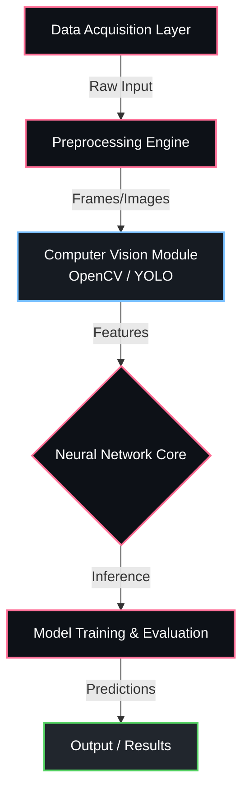

<div align="center">


<p align="center">
  
  
  
  
</p>

  


</div>

---

## Overview

> Vision-language agent for autonomous laptop control.

**AI Laptop Control Agent** is a proprietary machine learning / ai system engineered by **Karthik Idikuda**. It leverages OpenCV for its core functionality.

<br/>

## System Architecture



<br/>

## Project Structure

```
AI-Laptop-Control-Agent/
  .env
  ANALYSIS_SUMMARY.md
  AUTONOMOUS_AI_BLUEPRINT.md
  DRAWING_WORKFLOW.md
  FIXES_APPLIED.md
  FUTURISTIC_GUI_GUIDE.md
  GUI_CUSTOMIZATION.md
  IMPLEMENTATION_SUMMARY.md
  LICENSE
  MACOS_COMMANDS_AZ.md
  __pycache__/
    action_planner.cpython-311.pyc
    action_verifier.cpython-311.pyc
    agent.cpython-311.pyc
    agent.cpython-38.pyc
    app_manager.cpython-311.pyc
  screenshots/
```

<br/>

## Technical Specifications

| Attribute | Detail |
|:---|:---|
| **Primary Language** | `Python` |
| **Project Category** | `Machine Learning / AI` |
| **Total Source Files** | `216` |
| **Frameworks** | `OpenCV` |
| **Key Dependencies** | `numpy` | `requests` | `pynput` | `protobuf` | `Pillow` | `google-generativeai` | `schedule` | `python-dotenv` | `typing-extensions` | `pyautogui` | `PyQt5` | `pyobjc-core` | `opencv-python` | `pyobjc-framework-Cocoa` |
| **Intellectual Property** | `Strictly Proprietary` |

<br/>

## STRICT LEGAL WARNING & LICENSE

> **PROPRIETARY AND CONFIDENTIAL**

This software and all associated documentation are the **exclusive property of Karthik Idikuda**.

- **NO PERMISSION IS GRANTED** to use, copy, modify, merge, publish, distribute, sublicense, or sell copies of this software without explicit, written consent from the author.
- **UNAUTHORIZED USE WILL RESULT IN SEVERE LEGAL ACTION.** Any individual or organization found using, referencing, or deploying this code without paying the required licensing fees will face immediate litigation, financial penalties, and potentially criminal prosecution where applicable by law.
- **TO OBTAIN A LEGAL LICENSE**, you must directly contact Karthik Idikuda to negotiate payment terms.

*By accessing this repository, you acknowledge and accept these strict proprietary terms.*

---

<div align="center">
  
</div>

<!-- TRACKING: S0ktQUktTGFwdG9wLUNvbnRyb2wtQWdlbnQtVFJBQ0s= -->
