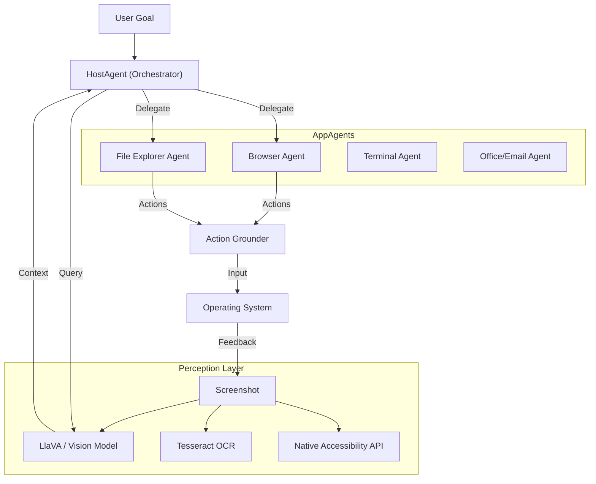

# AgentOS — Vision-First Autonomous Desktop Agent


**AgentOS** is a next-generation autonomous desktop agent that perceives your screen, plans complex multi-step tasks, and executes them across applications using a combination of vision (VLM) and native accessibility APIs.

> **Note**: This project is currently in active development. It uses **100% free, open-source tools** (Llama 3.2, LLaVA, Tesseract, Playwright) and runs locally to ensure privacy.

---

## 🧠 Core Philosophy

1.  **Vision-First Perception**: Uses Vision-Language Models (VLM) to "see" the screen like a human, robust to UI changes.
2.  **Hybrid Control**: Combines native OS accessibility APIs (UIA/AX) for reliability with vision-based fallback.
3.  **Planner-Executor-Reflect**: Decomposes high-level goals into atomic steps, executes them, and reflects on failures to retry.
4.  **Sandboxed Safety**: Runs potentially dangerous operations with human-in-the-loop confirmation and strict safety boundaries.

---

## 🏗 Architecture

AgentOS follows a modular multi-agent architecture:



### Components

-   **Perception Layer**: Combines `LLaVA` (via Ollama) for semantic understanding, `Tesseract` for OCR, and `OpenCV` for element detection.
-   **HostAgent**: The brain (powered by `Llama 3.2`) that decomposes natural language commands into structured plans.
-   **AppAgents**: Specialized micro-agents for specific domains (Browser, Files, Terminal, Email).
-   **Actuator**: A safety-enforced layer that translates semantic actions into OS-level inputs (using `pyautogui`, `PyObjC`).

---

## 🚀 Getting Started

### Prerequisites

-   **Python 3.10+**
-   **Ollama**: For running local LLMs and VLMs.
    -   Install Ollama: [ollama.com](https://ollama.com)
    -   Pull required models:
        ```bash
        ollama pull llava:13b      # Vision
        ollama pull llama3.2       # Planning
        ```
-   **Tesseract OCR**:
    -   macOS: `brew install tesseract`
    -   Windows: Install via binary installer.

### Installation

1.  Clone the repository:
    ```bash
    git clone https://github.com/Nytrynox/AI-Laptop-Control-Agent.git
    cd AI-Laptop-Control-Agent
    ```

2.  Create a virtual environment:
    ```bash
    python -m venv venv
    source venv/bin/activate  # Windows: venv\Scripts\activate
    ```

3.  Install dependencies:
    ```bash
    pip install -r requirements.txt
    ```

---

## 💻 Usage

Start the AgentOS CLI:

```bash
python -m agentos.cli
```

### Example Commands

**1. Research & Summarize**
> "Go to TechCrunch, find the latest article about AI, and save a summary to my Desktop."

**2. File Management**
> "Find all PDF files in Downloads created last week and move them to a new folder called 'Weekly Reports'."

**3. Cross-App Workflow**
> "Download the attachment from the latest email from 'Boss', convert it to CSV, and upload it to our internal dashboard."

---

## 🛡 Safety & Privacy

-   **Local Execution**: All inference runs locally on your machine. No screen data is sent to the cloud.
-   **Confirmation**: Destructive actions (delete, overwrite, send email) require explicit user confirmation.
-   **Audit Log**: Every action, screenshot, and decision is logged for review.

---

## 🗺 Roadmap

-   [ ] **Phase 1: MVP** - Basic perception, HostAgent, and Browser/File agents.
-   [ ] **Phase 2: Robustness** - Improved error recovery, hybrid UIA+Vision.
-   [ ] **Phase 3: Scale** - API exposure, more AppAgents, full CLI.

---

## 🤝 Contributing

Contributions are welcome! Please read `CONTRIBUTING.md` (coming soon) for details on our code of conduct and the process for submitting pull requests.

## 📄 License

This project is licensed under the MIT License - see the [LICENSE](LICENSE) file for details.
